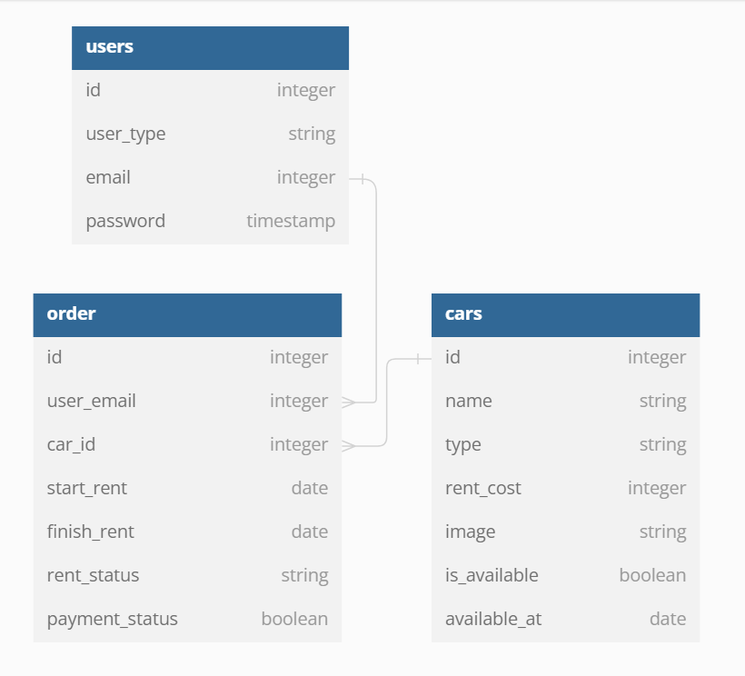

# Express TS Starter

Simple express TS starter!

## How to use?

```
$ npm install
$ npm run dev # run development!
```
## Postman Test Collection
You can import the postman collection by download CH5_Postman_Collection file

## Scripts

```
$ npm run build # build typescript project
$ npm start # run in development mode
```
## Database Structure (using dbdiagram.io)

